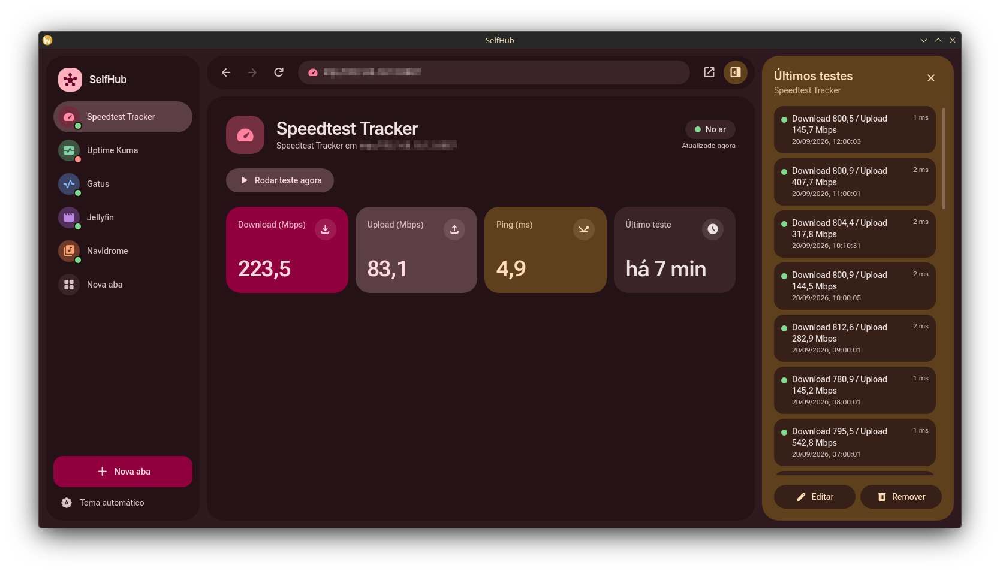
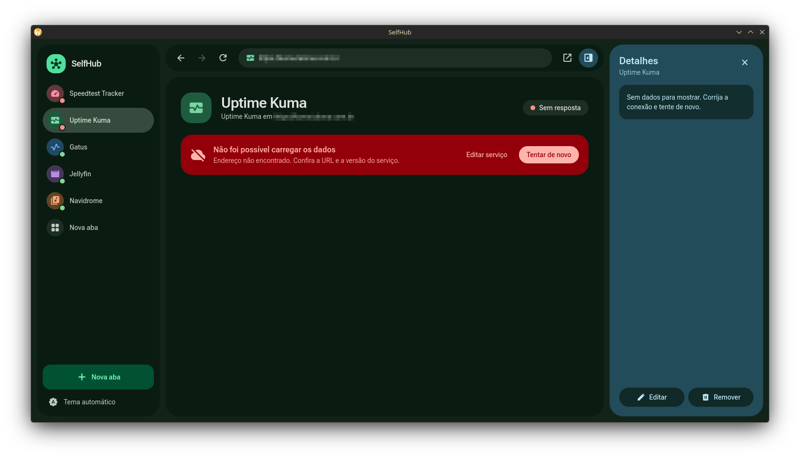
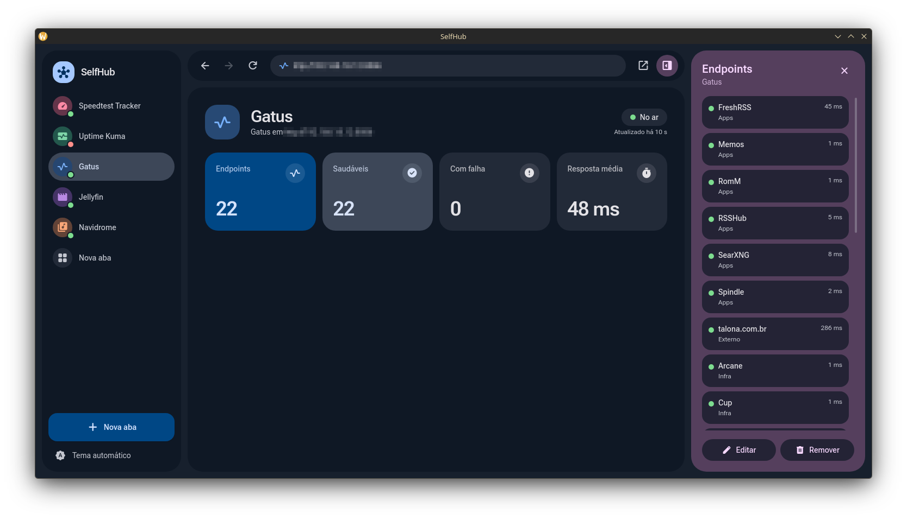
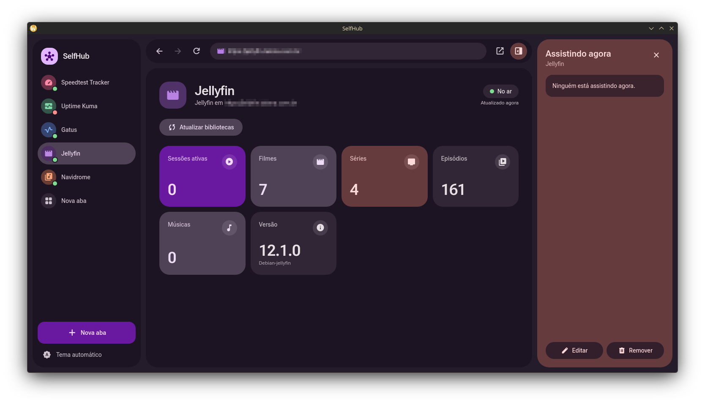
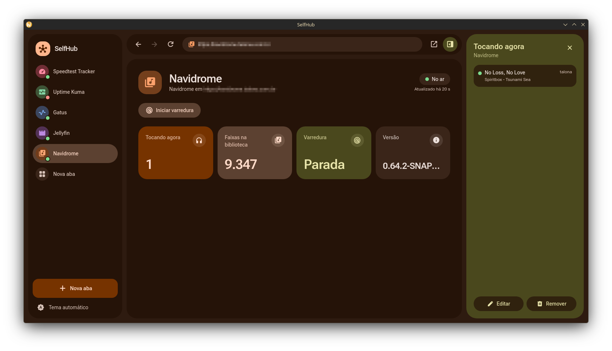
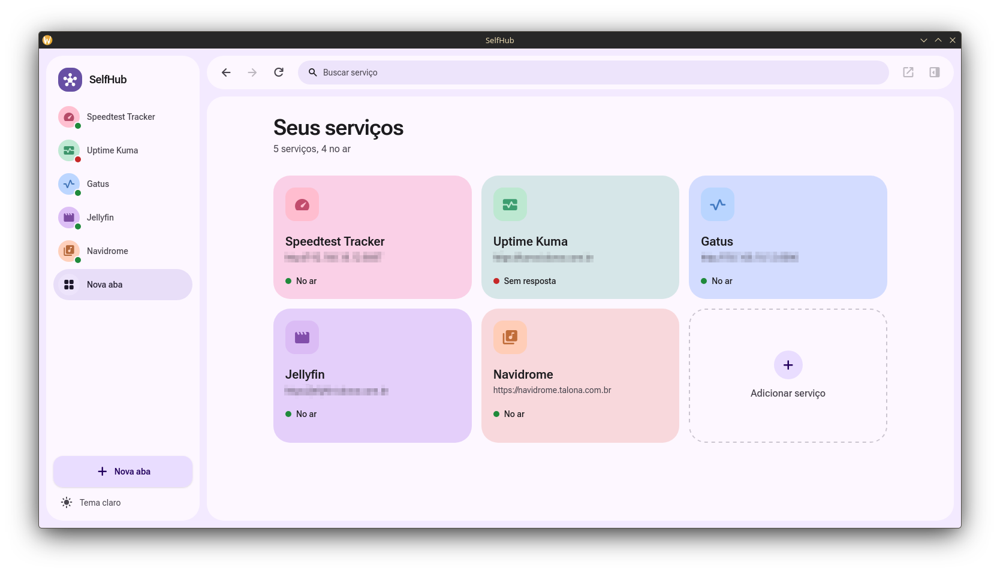

# Floria SelfHub

> **A modern desktop dashboard for your self-hosted services.**

Floria SelfHub brings your self-hosted services together in a single, clean interface.

Instead of opening multiple browser tabs to check your media server, monitoring tools, DNS, Docker services, and other infrastructure, SelfHub gives you one place to access and monitor everything.

Built for people who **self-host their own services** and want a simpler way to manage them.

<p align="center">
  <a href="https://github.com/FloriaApps/Floria-selfhub">
    
  </a>
  <a href="https://github.com/FloriaApps/Floria-selfhub/releases">
    
  </a>
  <a href="https://github.com/FloriaApps/Floria-selfhub/blob/main/LICENSE">
    
  </a>
</p>

## Estrutura

<<<<<<< Updated upstream
## ✨ Features

### 🖥️ One place for your services

Access multiple self-hosted services through a single desktop application instead of managing a collection of browser tabs.

### 🧩 Service integrations

SelfHub uses independent adapters for each supported service.

This makes integrations modular and allows new services to be added without changing the core application.

### 📊 Service information

View useful information directly inside SelfHub, depending on the integration:

- Media sessions
- Libraries
- Currently playing media
- Service health
- Endpoint status
- Internet speed
- Docker image updates
- DNS information
- Monitoring data

### 🗂️ Browser-inspired interface

SelfHub uses a familiar tab-based interface, allowing each service to have its own workspace.

Information is organized into cards so important data can be accessed quickly.

### 🌗 Dark & Light Mode

SelfHub supports both dark and light interfaces.
=======
```
src/
  lib/i18n.ts    textos em inglês e português (adicione novas chaves nos dois)
  services/      um adapter por serviço, mais registry.ts (nome, ícone, cor e campos de cada um)
  stores/        Pinia: services (lista salva), tabs, snapshots (dados e polling de 30 s), ui
  components/    TabSidebar, Toolbar, TabContent, HomeView, ServiceView, RightPanel, ServiceModal...
  lib/           i18n (traduções), http (plugin-http com fallback para fetch), storage, theme (Material 3), format
src-tauri/       Rust, tauri.conf.json e capabilities/default.json (permissões de HTTP, store e opener)
```

## Adicionar um novo serviço

1. Crie `src/services/meu-servico.ts` exportando uma função `(config) => ServiceAdapter`. O método `snapshot()` devolve
   os cards (`stats`) e a lista do painel direito (`items`). Opcionalmente, `actions` cria botões de ação.
2. Inclua o tipo em `ServiceType` (`services/types.ts`).
3. Registre em `services/registry.ts`: `META` (nome, ícone Material Symbols, cor, campos do formulário) e `FACTORIES`.
4. Todo texto visível passa por `t('chave')`. Adicione a chave em inglês e português em `src/lib/i18n.ts`.
>>>>>>> Stashed changes

A cor definida em `META` também vira o tema do app quando a aba está ativa.

<<<<<<< Updated upstream
## 🔌 Supported Services

<table align="center">
  <tr>
    <td align="center" width="25%">
      <a href="https://jellyfin.org">
        
      </a><br>
      <b>Jellyfin</b><br>
      <sub>Sessions & library</sub>
    </td>
    <td align="center" width="25%">
      <a href="https://www.navidrome.org">
        
      </a><br>
      <b>Navidrome</b><br>
      <sub>Now playing & library</sub>
    </td>
    <td align="center" width="25%">
      <a href="https://github.com/louislam/uptime-kuma">
        
      </a><br>
      <b>Uptime Kuma</b><br>
      <sub>Monitors</sub>
    </td>
    <td align="center" width="25%">
      <a href="https://github.com/TwiN/gatus">
        
      </a><br>
      <b>Gatus</b><br>
      <sub>Endpoint health</sub>
    </td>
  </tr>

  <tr>
    <td align="center" width="25%">
      <a href="https://github.com/alexjustesen/speedtest-tracker">
        
      </a><br>
      <b>Speedtest Tracker</b><br>
      <sub>Internet speed</sub>
    </td>
    <td align="center" width="25%">
      <a href="https://github.com/sergi0g/cup">
        
      </a><br>
      <b>Cup</b><br>
      <sub>Image updates</sub>
    </td>
    <td align="center" width="25%">
      <a href="https://github.com/getwud/wud">
        
      </a><br>
      <b>What's up Docker</b><br>
      <sub>Container updates</sub>
    </td>
    <td align="center" width="25%">
      <a href="https://github.com/AdguardTeam/AdGuardHome">
        
      </a><br>
      <b>AdGuard Home</b><br>
      <sub>DNS & blocking</sub>
    </td>
  </tr>
</table>

> More integrations are planned as SelfHub evolves.

---

## 🖼️ Screenshots

### Dark Mode

<p align="center">
  
  
</p>

<p align="center">
  
  
</p>

<p align="center">
  
</p>

### Light Mode

<p align="center">
  
</p>

---

## 🛠️ Built With

| Technology | Role |
| --- | --- |
| **Tauri v2** | Desktop application framework |
| **Vue 3** | User interface |
| **Tailwind CSS 4** | Styling and design system |
| **Rust** | Application backend and native functionality |

---

## 🧱 Architecture

SelfHub is designed around a modular integration system.

Each supported service is implemented through its own adapter, responsible for communicating with the service API and providing the data required by the interface.

This approach makes it easier to:

- Add new integrations
- Maintain existing integrations
- Keep service-specific logic isolated
- Expand SelfHub without increasing complexity in the core application

---

## 🎯 Goals

SelfHub is built around a simple idea:

> **Self-hosting shouldn't require dozens of browser tabs.**

The goal is to provide a single desktop environment where users can quickly access and understand their self-hosted infrastructure.

SelfHub aims to be:

- **Simple** — easy to understand at a glance.
- **Modular** — integrations can evolve independently.
- **Modern** — built with a contemporary desktop stack.
- **Private** — designed around services you control.
- **Extensible** — new integrations can be added over time.

---

## 🚧 Status

SelfHub is currently under active development.

Features, integrations, and the interface may change as the project evolves.

---

<div align="center">

**Floria SelfHub**

*Your services. One place.*

Built by [FloriaApps](https://github.com/FloriaApps)

</div>

